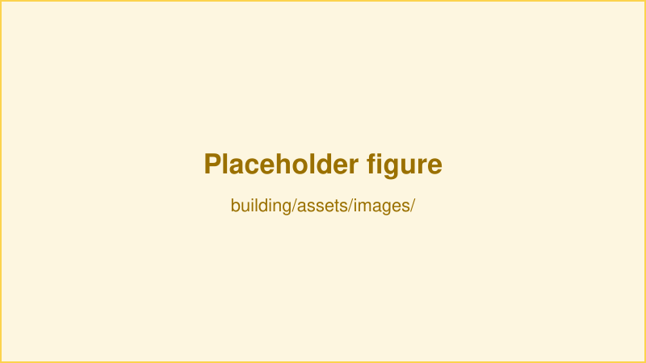

# {{ $frontmatter.title }}

> **This page is a template.** It exists to show every markdown convention used
> on this site. Copy it to a new file, rename it, add the new file to
> `getBuildingSidebar()` in `.vuepress/config.ts`, and overwrite the content
> below.

Open with one short paragraph describing what the module is and what it does, before any headings. This is the text a reader skims to decide whether they are on the right page.

## Figures

Use a `<figure>` element rather than markdown image syntax — it gives you a caption and keeps the sizing consistent. Image paths are relative to this file, so images live in `building/assets/images/<module-name>/`.

<figure>
  
  <center><figcaption><small>A caption goes here, in small text, centered.</small></figcaption></center>
</figure>

A figure without a caption is fine too, when the surrounding text already explains it.

<figure>
  
</figure>

## Assembly

Number the assembly steps. Keep one action per step, and put the figure directly beneath the step it illustrates.

1. Describe the first action, naming the exact part and fastener — for example "an 8-32 thread size, 1/4" long low-profile screw". Vendor part numbers belong inline so nobody has to guess.

<figure>
  
</figure>

2. Describe the second action. If a step depends on a procedure documented elsewhere, link to the specific heading rather than repeating it — see the [maintenance example](/maintenance/example-module.html#preventive-maintenance).

3. Describe the third action.

## Callouts

Three container types are available. Use `tip` for practical advice that saves time:

::: tip
We don't route this tubing through the cable carrier because it has to be replaced monthly, and that makes maintenance time consuming.
:::

Use `warning` for things that are easy to get wrong:

::: warning
Check the orientation before tightening. The part fits both ways round, but only one is correct.
:::

Use `danger` for anything that can damage hardware or injure someone:

::: danger
Disconnect the air supply before removing the manifold.
:::

## Downloadable files

CAD files, GERBERs and STEP archives go in `building/assets/drawings/` or
`building/assets/GERBER/`. The webpack `file-loader` rule in
`.vuepress/config.ts` handles `.pdf`, `.zip`, `.ait`, `.log`, `.txt` and `.stp`.

For a file that must download rather than open in the browser, put a copy in
`.vuepress/public/` and use an HTML anchor with the `download` attribute. Files
under `public/` are served from the site root, but the published site lives in a
subdirectory, so wrap the path in `$withBase` instead of hardcoding a leading
slash — otherwise the link 404s on the deployed site while working locally:

```html
<a :href="$withBase('/building/drawings/my-rig.step.zip')" download>Download the STEP files</a>
```

## Tables

| Part | Vendor | Part number | Qty |
| --- | --- | --- | --- |
| Kinetic base | Thorlabs | KB1X1 | 1 |
| Dovetail translation stage | Thorlabs | DT12 | 1 |
| Low-profile screw, 8-32 × 1/4" | Thorlabs | SH8S025 | 4 |

## Linking between pages

Links between documentation pages use the built `.html` path, not the `.md` one:

- Another page in this section: [`/building/example-module.html`](/building/example-module.html)
- A specific heading: [`/building/example-module.html#assembly`](/building/example-module.html#assembly)
- A different section: [`/software/example-tool.html`](/software/example-tool.html)
