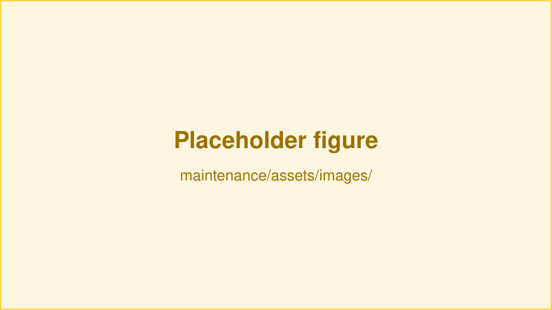

# {{ $frontmatter.title }}

> **This page is a template.** Copy it, rename it, add the new file to
> `getMaintenanceSidebar()` in `.vuepress/config.ts`, and overwrite the content.

Maintenance pages follow a fixed shape so that anyone on rig duty knows where to look: what to do on a schedule, what to do when something breaks, and what has gone wrong before.

## Preventive maintenance

State the interval up front, then list the actions.

**Every week**

1. First scheduled action.
2. Second scheduled action.

**Every month**

1. Replace the consumable, naming the exact part.

::: tip
Note the tools needed for the procedure before the steps, so nobody starts and then has to go find a hex key.
:::

<figure>
  
  
<figcaption><small>Point out what to inspect in the caption.</small></figcaption>

</figure>

## Corrective maintenance

Describe the repair procedures for the parts that fail, one subsection per failure mode.

### Replacing a worn part

1. Power down and disconnect whatever must be disconnected.
2. Perform the replacement.
3. Verify the fix before putting the rig back in service.

## Troubleshooting

A table works well here — symptom first, since that is what the reader arrives with.

| Symptom | Likely cause | Fix |
| --- | --- | --- |
| Describe what the user observes | The usual cause | What to do, linking to the procedure above |
| A second symptom | Another cause | [Replacing a worn part](/maintenance/example-module.html#replacing-a-worn-part) |

::: warning
If the symptom persists after the fix, stop and flag it rather than repeating the procedure — repeated failures usually mean a different root cause.
:::
